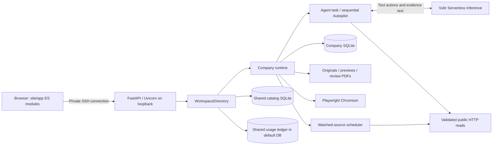

# Architecture and technologies

## Runtime topology

Public nginx serves a copy of `site/` separately. It does not proxy the private API. The API also serves `site/` from its checkout. Consequently, updating `/opt/rfp-agent/site` changes the private app, while the public copy under `/var/www/rfp-agent` needs an explicit static deployment.

## Stack

| Technology | Role / source of truth |
|---|---|
| Python 3.12 development baseline | Backend and tests; Ubuntu installer uses system Python 3 |
| FastAPI 0.141.1, Uvicorn 0.54.0 | ASGI API and server; `app/requirements.txt` |
| Pydantic | Request/action validation; transitive FastAPI dependency, not separately pinned |
| SQLite / Python sqlite3 | Workspace data, provenance, jobs, queue history and budget; no external DB |
| Playwright 1.63.0 / Chromium | Server-side interactive browser; browser installed separately |
| pypdf 6.19.0 | Extract PDF text/pages and inspect generated page counts |
| ReportLab 4.4.9 | Immutable review PDF rendering |
| Pillow 12.3.0 | Validate and normalize image attachments before OCR |
| Poppler / `pdftoppm` | First-page PDF thumbnails; OS package |
| Tesseract / English data | Image attachment OCR; OS package |
| Python zipfile / ElementTree | Bounded DOCX text extraction; no Word service |
| Vanilla HTML/CSS/ES modules | Workspace; no package manager/build step required |
| Node built-in test runner | Frontend unit tests; no npm dependencies |
| Vultr Serverless Inference | OpenAI-compatible chat-completions protocol; configured model, deployed baseline `glm-5.3` |
| Gemini Live (optional) | Voice conversation: the server mints a single-use token with Billy's instruction and two functions locked in; the browser streams 16 kHz PCM in and plays 24 kHz PCM out; `ask_billy` posts to the agent API. Gemini never chooses agent actions |
| Optional Meta transcription | Push-to-talk transcript into the editable composer; separate from the main Vultr agent |
| systemd / nginx / SSH | Private backend, public static pages, private operator access |
| macOS launchd | Existing demo operator's automatic tunnel reconnection; external host configuration |
| Mermaid 12.0.0 / Google Fonts | Public technical diagram and typography; CDN/font fallbacks |

Pin changes belong in requirements and must be validated together with the Chromium AppArmor path. No OpenAI SDK or locally hosted model weights are used by the main agent.

## Composition and ownership

`server.py` creates the base SQLite schema, registers feature modules, browser and scheduler, then wraps the default app in `WorkspaceDirectory`. Child companies load `server.py` under separate module names with explicit data-directory, source, usage and catalog bindings. This prevents changing an in-flight job's data destination when the user switches workspaces.

Each company owns one agent task and one browser/controller state. These live in the ASGI process; persisted records do not constitute a durable task queue. **Use one Uvicorn worker.** Multiple workers would duplicate schedulers and bypass in-memory task/ownership locks. Synchronous SQLite transactions and one VM constrain scale.

`ClosingConnection` commits/rolls back and closes on context exit. Use the supplied database factories; a plain SQLite connection context does not close the connection. A prior descriptor-exhaustion incident makes this a meaningful convention.

## Discovery, ranking and pursuit

The read-only directory supplies source records. The watcher scans watched sources, follows bounded pagination, stores listings and original PDFs where available, and retains prior evidence after failures. Tested adapters cover Berkeley and Municode-style tables; other pages use conservative generic extraction.

Shared imports live in `catalog.sqlite3`. Synchronization creates/links company-local RFP records without copying another company's private work. Inactive batches disappear from opportunity feeds, but pursued records and saved work remain.

Feed fit is deterministic: 65% title-term overlap and 35% body-term overlap against company overview/services/sectors/projects. No fit threshold removes candidates. The agent subsequently evaluates evidence, geography, feasibility and deadlines; that judgment is not equivalent to the feed score.

## Agent execution

`agent.py` requests one `billy_action` at a time, validates it, executes an allowlisted tool, and persists arguments/results before continuing. Invalid action format permits up to three request attempts. A completion-review request can redirect a premature ask/finish into the next required tool. Normal turns allow 24 actions; Autopilot allows 80 per item. Model-request retries and reply rewrites consume budget too.

Continuous mode wraps the item loop in one cancellable task. `agent_queues` binds the run to a queue session; `agent_queue_items` records ready/blocked RFPs. Completion records the chat outcome, item and cleared selection in one database transaction. The run stays `running` while advancing. Error, paused and interrupted states retain saved work. Already-ready selected work on continuous resume advances without redrafting.

Text from websites, documents, user data and tool results is untrusted evidence, not permission or instructions. The model has no unrestricted networking or shell. Source reads are limited to recorded RFP URLs and links discovered from them, with public-address checks. Company-site reading follows a separate same-site browser workflow.

## Frontend state

`workspace.js` composes navigation and feature controllers. `agent-chat.js` polls snapshots and refreshes the pipeline after selection/draft/export transitions; `autopilot.js` owns queue controls and final-review UI. URLs carry `?workspace=<id>` and hash navigation; resource URLs use `/w/<id>/api/...`.

Billy's motion derives from actual run/browser/document state. Autopilot keeps the researching animation at 1.8× between actions. Browser control/approval and connection states take precedence where appropriate. User pause, reduced motion and hidden-page behavior remain respected. A document-review card shows actual source preview/page-read counts rather than claiming an animation proves review.

Static module imports use cache query versions. Bump affected import URLs and the entry script when changing shipped modules; there is no bundler to invalidate them automatically.

The Response tab (`response-canvas.js`, composed by `rfp-detail.js`) displays all three sections on one continuous paper surface. Auto-growing text areas avoid nested text scrolling. Canvas and individual section tabs share in-memory drafts and original version baselines. Untouched copies refresh from the server; actual edits retain their original version for conflict detection.
